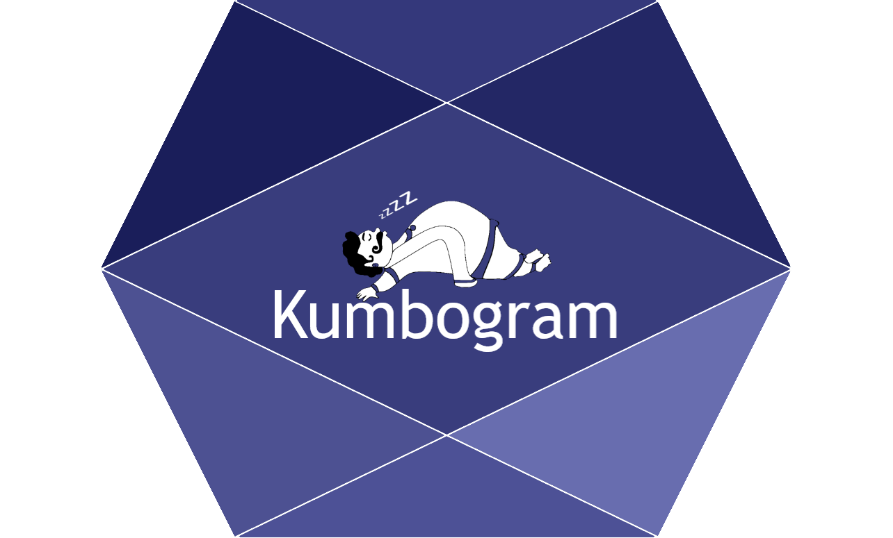

<!-- README.md is generated from README.Rmd. Please edit that file -->

```{r, include = FALSE}
knitr::opts_chunk$set(
  collapse = TRUE,
  comment = "#>",
  fig.path = "man/figures/README-",
  out.width = "300%"
)
```

# Kumbogram 

<!-- badges: start -->
[](https://rahulvenugopal.github.io/Kumbogram/)
<!-- badges: end -->

The goal of Kumbogram is to spit out sleep macro architecture parameters from hypnogram file

## Installation

You can install the development version of Kumbogram from [GitHub](https://github.com/) with:

``` r
# install.packages("devtools")
devtools::install_github("rahulvenugopal/Kumbogram")
```

## Example

This is a basic example which shows you how to use the function:

```{r example}
library(Kumbogram)
```

```
library(reader)
filename = 'data_full_6hrs_100Hz_hypno_30s.txt'
hypnogram_file <- n.readLines(paste(filename, sep = "\n"),
                              header = FALSE,
                              n=720)

sleep_data <- fetch_sleep_parametres(hypnogram_file = hypnogram_file,
                                     epoch_duration = 30)
```
#### Kumbogram package has many useful functions to:

1. Gather sleep architecture related parameters from a scored hypnogram file


`fetch_sleep_params` functions extracts `32` sleep variables

### Sleep stage durations, percentages and efficiency
1. Wake_duration
2. N1_duration
3. N2_duration
4. N3_duration
5. R_duration
6. Wake_percentage
7. N1_percentage
8. N2_percentage
9. N3_percentage
10. R_percentage,
11. sleep_efficiency

### Onsets and total sleep time
12. Wake_onset
13. N1_onset
14. N2_onset
15. N3_onset
16. R_onset
17. TST

### Longest streak of each sleep stage by epochs count
18. W_longest_streak
19. N1_longest_streak
20. N2_longest_streak
21. N3_longest_streak
22. R_longest_streak

### Longest streak of each sleep stage by duration
23. W_mean_length_of_streak
24. N1_mean_length_of_streak
25. N2_mean_length_of_streak
26. N3_mean_length_of_streak
27. R_mean_length_of_streak
28. W_median_length_of_streak
29. N1_median_length_of_streak
30. N2_median_length_of_streak
31. N3_median_length_of_streak
32. R_median_length_of_streak
