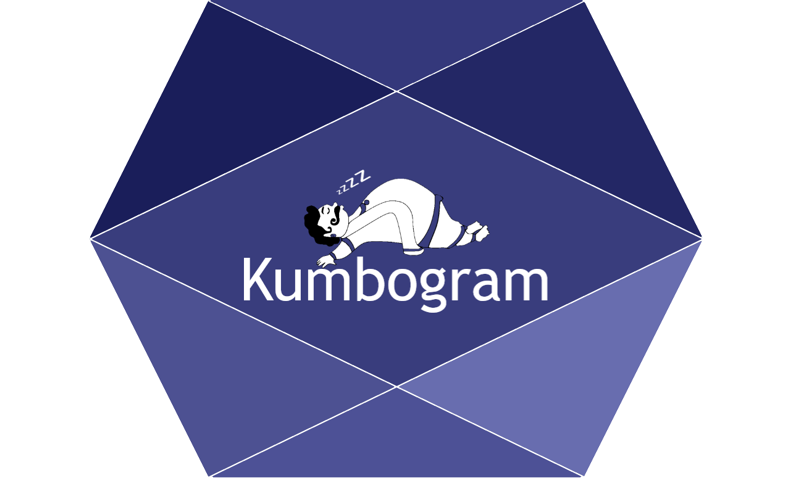

<!-- README.md is generated from README.Rmd. Please edit that file -->

# Kumbogram 

<!-- badges: start -->

[](https://rahulvenugopal.github.io/Kumbogram/)
<!-- badges: end -->

The goal of Kumbogram is to spit out sleep macro architecture parameters from hypnogram file. Not under active development. Archived this and building [PyKumbogram](https://github.com/rahulvenugopal/PyKumbogram)

## Installation

You can install the development version of Kumbogram from
[GitHub](https://github.com/) with:

``` r
# install.packages("devtools")
devtools::install_github("rahulvenugopal/Kumbogram")
```

## Example

This is a basic example which shows you how to use the function:

``` r
library(Kumbogram)
```

    library(reader)
    filename = 'data_full_6hrs_100Hz_hypno_30s.txt'
    hypnogram_file <- n.readLines(paste(filename, sep = "\n"),
                                  header = FALSE,
                                  n=720)

    sleep_data <- fetch_sleep_parametres(hypnogram_file = hypnogram_file,
                                         epoch_duration = 30)

#### Kumbogram package has many useful functions to:

1.  Gather sleep architecture related parameters from a scored hypnogram
    file

`fetch_sleep_params` functions extracts `32` sleep variables

### Sleep stage durations, percentages and efficiency

1.  Wake\_duration
2.  N1\_duration
3.  N2\_duration
4.  N3\_duration
5.  R\_duration
6.  Wake\_percentage
7.  N1\_percentage
8.  N2\_percentage
9.  N3\_percentage
10. R\_percentage,
11. sleep\_efficiency

### Onsets and total sleep time

12. Wake\_onset
13. N1\_onset
14. N2\_onset
15. N3\_onset
16. R\_onset
17. TST

### Longest streak of each sleep stage by epochs count

18. W\_longest\_streak
19. N1\_longest\_streak
20. N2\_longest\_streak
21. N3\_longest\_streak
22. R\_longest\_streak

### Longest streak of each sleep stage by duration

23. W\_mean\_length\_of\_streak
24. N1\_mean\_length\_of\_streak
25. N2\_mean\_length\_of\_streak
26. N3\_mean\_length\_of\_streak
27. R\_mean\_length\_of\_streak
28. W\_median\_length\_of\_streak
29. N1\_median\_length\_of\_streak
30. N2\_median\_length\_of\_streak
31. N3\_median\_length\_of\_streak
32. R\_median\_length\_of\_streak
